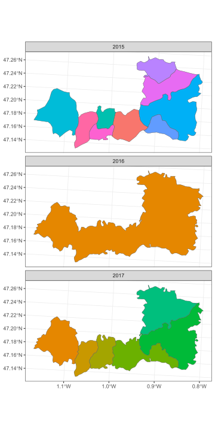

Position du problème
====================

Millésimes d'IRIS
-----------------

Les IRIS évoluent dans le temps, et on ne dispose pas dans les bases
de l'INSEE d'une table stricte de correspondance entre les millésimes
des IRIS.

Les modifications d'IRIS peuvent provenir de :

1. Création/fusion d'IRIS existants

2. Fusion/scission de communes

3. Échange de parcelles


Documentation disponible
------------------------

L'INSEE met à disposition des tables de référentiels d'IRIS (liste des
IRIS officiels pour une année données), ainsi qu'une table listant les
modification survenue dans les IRIS les 5 années précédentes.

Si les référentiels d'IRIS pour une année donnée sont complets et fiables, la
documentation sur les modification est assez fragmentaire, voir
parfois trompeuse, et ne permet pas à elle seule de construire une
table de passage entre les différents millésimes.

Ces difficultés d'utilisation de la documentation sont de deux ordres.

### Modifications sur les 5 dernières années ###

D'une part, les modifications rapportées dans les onglets couvrent une
période de 5 ans, sans que l'année de modification réelle de l'IRIS
soit rapportée dans la table.

Par exemple, dans la table des modifications d'IRIS de 2017, l'IRIS
"490180103" est rapporté comme étant la fusion de plusieurs IRIS de
2016, du fait de fusion de communes: 

<table class="table" style="margin-left: auto; margin-right: auto;">
 <thead>
  <tr>
   <th style="text-align:right;"> annee_modif </th>
   <th style="text-align:left;"> IRIS_INI </th>
   <th style="text-align:left;"> COM_INI </th>
   <th style="text-align:left;"> LIB_COM_INI </th>
   <th style="text-align:left;"> IRIS_FIN </th>
   <th style="text-align:left;"> COM_FIN </th>
   <th style="text-align:left;"> LIB_COM_FIN </th>
   <th style="text-align:left;"> MODIF_IRIS </th>
   <th style="text-align:left;"> NATURE_MODIF </th>
   <th style="text-align:left;"> an </th>
  </tr>
 </thead>
<tbody>
  <tr>
   <td style="text-align:right;"> 2017 </td>
   <td style="text-align:left;"> 491570000 </td>
   <td style="text-align:left;"> 49157 </td>
   <td style="text-align:left;"> Le Guédeniau </td>
   <td style="text-align:left;"> 490180103 </td>
   <td style="text-align:left;"> 49018 </td>
   <td style="text-align:left;"> Baugé-en-Anjou </td>
   <td style="text-align:left;"> 3 </td>
   <td style="text-align:left;"> Rétablissement/Fusion de communes irisées </td>
   <td style="text-align:left;"> 2017 </td>
  </tr>
  <tr>
   <td style="text-align:right;"> 2017 </td>
   <td style="text-align:left;"> 491160000 </td>
   <td style="text-align:left;"> 49116 </td>
   <td style="text-align:left;"> Cuon </td>
   <td style="text-align:left;"> 490180103 </td>
   <td style="text-align:left;"> 49018 </td>
   <td style="text-align:left;"> Baugé-en-Anjou </td>
   <td style="text-align:left;"> 3 </td>
   <td style="text-align:left;"> Rétablissement/Fusion de communes irisées </td>
   <td style="text-align:left;"> 2017 </td>
  </tr>
  <tr>
   <td style="text-align:right;"> 2017 </td>
   <td style="text-align:left;"> 490310000 </td>
   <td style="text-align:left;"> 49031 </td>
   <td style="text-align:left;"> Bocé </td>
   <td style="text-align:left;"> 490180103 </td>
   <td style="text-align:left;"> 49018 </td>
   <td style="text-align:left;"> Baugé-en-Anjou </td>
   <td style="text-align:left;"> 3 </td>
   <td style="text-align:left;"> Rétablissement/Fusion de communes irisées </td>
   <td style="text-align:left;"> 2017 </td>
  </tr>
  <tr>
   <td style="text-align:right;"> 2017 </td>
   <td style="text-align:left;"> 490790000 </td>
   <td style="text-align:left;"> 49079 </td>
   <td style="text-align:left;"> Chartrené </td>
   <td style="text-align:left;"> 490180103 </td>
   <td style="text-align:left;"> 49018 </td>
   <td style="text-align:left;"> Baugé-en-Anjou </td>
   <td style="text-align:left;"> 3 </td>
   <td style="text-align:left;"> Rétablissement/Fusion de communes irisées </td>
   <td style="text-align:left;"> 2017 </td>
  </tr>
  <tr>
   <td style="text-align:right;"> 2017 </td>
   <td style="text-align:left;"> 492450000 </td>
   <td style="text-align:left;"> 49245 </td>
   <td style="text-align:left;"> Pontigné </td>
   <td style="text-align:left;"> 490180103 </td>
   <td style="text-align:left;"> 49018 </td>
   <td style="text-align:left;"> Baugé-en-Anjou </td>
   <td style="text-align:left;"> 3 </td>
   <td style="text-align:left;"> Rétablissement/Fusion de communes irisées </td>
   <td style="text-align:left;"> 2017 </td>
  </tr>
</tbody>
</table>

Le problème, c'est que ces mofications de communes ont eu lieu en
2016, et non en 2017, comme le montre la table de passage des communes.

<table class="table" style="margin-left: auto; margin-right: auto;">
 <thead>
  <tr>
   <th style="text-align:left;"> com_2015 </th>
   <th style="text-align:left;"> com_2016 </th>
   <th style="text-align:left;"> com_2017 </th>
  </tr>
 </thead>
<tbody>
  <tr>
   <td style="text-align:left;"> 49018 </td>
   <td style="text-align:left;"> 49018 </td>
   <td style="text-align:left;"> 49018 </td>
  </tr>
  <tr>
   <td style="text-align:left;"> 49031 </td>
   <td style="text-align:left;"> 49018 </td>
   <td style="text-align:left;"> 49018 </td>
  </tr>
  <tr>
   <td style="text-align:left;"> 49079 </td>
   <td style="text-align:left;"> 49018 </td>
   <td style="text-align:left;"> 49018 </td>
  </tr>
  <tr>
   <td style="text-align:left;"> 49097 </td>
   <td style="text-align:left;"> 49018 </td>
   <td style="text-align:left;"> 49018 </td>
  </tr>
  <tr>
   <td style="text-align:left;"> 49101 </td>
   <td style="text-align:left;"> 49018 </td>
   <td style="text-align:left;"> 49018 </td>
  </tr>
  <tr>
   <td style="text-align:left;"> 49116 </td>
   <td style="text-align:left;"> 49018 </td>
   <td style="text-align:left;"> 49018 </td>
  </tr>
  <tr>
   <td style="text-align:left;"> 49128 </td>
   <td style="text-align:left;"> 49018 </td>
   <td style="text-align:left;"> 49018 </td>
  </tr>
  <tr>
   <td style="text-align:left;"> 49143 </td>
   <td style="text-align:left;"> 49018 </td>
   <td style="text-align:left;"> 49018 </td>
  </tr>
  <tr>
   <td style="text-align:left;"> 49157 </td>
   <td style="text-align:left;"> 49018 </td>
   <td style="text-align:left;"> 49018 </td>
  </tr>
  <tr>
   <td style="text-align:left;"> 49315 </td>
   <td style="text-align:left;"> 49018 </td>
   <td style="text-align:left;"> 49018 </td>
  </tr>
</tbody>
</table>

Cette liste des modifications rapportées pour cet IRIS est donc obsolète
pour 2017. 

Celà pourrait être sans conséquence si l'IRIS "490180103" n'avait pas
changé entre 2016 et 2017. Or, il se trouve que l'IRIS "490180103"
n'existait pas en 2016 et est apparu en 2017...

On se trouve ici dans un cas de figure tordu, où, pour un IRIS qui
apparait en 2017, on dispose d'information dans la table des
modifications, mais que ces informations concernent des modifications
antérieures apportées à un IRIS parent de l'IRIS "490180103" en 2016. 

Il s'agit dans ce cas de l'IRIS "490180000", qui résultait de la
fusion des communes en 2016, et qui a été redivisé en 2017 en 5
nouveaux IRIS, pour lesquels on ne dispose pas de documentation
adaptée dans les tables INSEE.

Si on va chercher dans la table des référentiels, la situation
s'éclaircit : la commune "49018", non irisée en 2016, est découpée en
IRIS en 2017.


```
#> Warning: `cols` is now required when using `unnest()`.
#> ℹ Please use `cols = c(dt_ref)`.
```

<table class="table" style="margin-left: auto; margin-right: auto;">
 <thead>
  <tr>
   <th style="text-align:right;"> annee_geo </th>
   <th style="text-align:left;"> iris </th>
   <th style="text-align:left;"> lib_iris </th>
   <th style="text-align:left;"> com </th>
   <th style="text-align:left;"> typ_iris </th>
   <th style="text-align:left;"> modif_iris </th>
   <th style="text-align:left;"> triris </th>
   <th style="text-align:left;"> grd_quart </th>
   <th style="text-align:left;"> libcom </th>
   <th style="text-align:left;"> uu2010 </th>
   <th style="text-align:left;"> reg </th>
   <th style="text-align:left;"> dep </th>
  </tr>
 </thead>
<tbody>
  <tr>
   <td style="text-align:right;"> 2016 </td>
   <td style="text-align:left;"> 490180000 </td>
   <td style="text-align:left;"> Baugé-en-Anjou (commune non irisée) </td>
   <td style="text-align:left;"> 49018 </td>
   <td style="text-align:left;"> Z </td>
   <td style="text-align:left;"> 0 </td>
   <td style="text-align:left;"> ZZZZZZ </td>
   <td style="text-align:left;"> 4901800 </td>
   <td style="text-align:left;"> Baugé-en-Anjou </td>
   <td style="text-align:left;"> 49306 </td>
   <td style="text-align:left;"> 52 </td>
   <td style="text-align:left;"> 49 </td>
  </tr>
  <tr>
   <td style="text-align:right;"> 2017 </td>
   <td style="text-align:left;"> 490180101 </td>
   <td style="text-align:left;"> Baugé </td>
   <td style="text-align:left;"> 49018 </td>
   <td style="text-align:left;"> H </td>
   <td style="text-align:left;"> 2 </td>
   <td style="text-align:left;"> ZZZZZZ </td>
   <td style="text-align:left;"> 4901801 </td>
   <td style="text-align:left;"> Baugé-en-Anjou </td>
   <td style="text-align:left;"> 49306 </td>
   <td style="text-align:left;"> 52 </td>
   <td style="text-align:left;"> 49 </td>
  </tr>
  <tr>
   <td style="text-align:right;"> 2017 </td>
   <td style="text-align:left;"> 490180102 </td>
   <td style="text-align:left;"> Vieil Baugé </td>
   <td style="text-align:left;"> 49018 </td>
   <td style="text-align:left;"> H </td>
   <td style="text-align:left;"> 3 </td>
   <td style="text-align:left;"> ZZZZZZ </td>
   <td style="text-align:left;"> 4901801 </td>
   <td style="text-align:left;"> Baugé-en-Anjou </td>
   <td style="text-align:left;"> 49306 </td>
   <td style="text-align:left;"> 52 </td>
   <td style="text-align:left;"> 49 </td>
  </tr>
  <tr>
   <td style="text-align:right;"> 2017 </td>
   <td style="text-align:left;"> 490180103 </td>
   <td style="text-align:left;"> Bocé </td>
   <td style="text-align:left;"> 49018 </td>
   <td style="text-align:left;"> H </td>
   <td style="text-align:left;"> 3 </td>
   <td style="text-align:left;"> ZZZZZZ </td>
   <td style="text-align:left;"> 4901801 </td>
   <td style="text-align:left;"> Baugé-en-Anjou </td>
   <td style="text-align:left;"> 49306 </td>
   <td style="text-align:left;"> 52 </td>
   <td style="text-align:left;"> 49 </td>
  </tr>
  <tr>
   <td style="text-align:right;"> 2017 </td>
   <td style="text-align:left;"> 490180201 </td>
   <td style="text-align:left;"> Clefs </td>
   <td style="text-align:left;"> 49018 </td>
   <td style="text-align:left;"> H </td>
   <td style="text-align:left;"> 3 </td>
   <td style="text-align:left;"> ZZZZZZ </td>
   <td style="text-align:left;"> 4901802 </td>
   <td style="text-align:left;"> Baugé-en-Anjou </td>
   <td style="text-align:left;"> 49306 </td>
   <td style="text-align:left;"> 52 </td>
   <td style="text-align:left;"> 49 </td>
  </tr>
  <tr>
   <td style="text-align:right;"> 2017 </td>
   <td style="text-align:left;"> 490180202 </td>
   <td style="text-align:left;"> Cheviré-le-Rouge </td>
   <td style="text-align:left;"> 49018 </td>
   <td style="text-align:left;"> H </td>
   <td style="text-align:left;"> 3 </td>
   <td style="text-align:left;"> ZZZZZZ </td>
   <td style="text-align:left;"> 4901802 </td>
   <td style="text-align:left;"> Baugé-en-Anjou </td>
   <td style="text-align:left;"> 49306 </td>
   <td style="text-align:left;"> 52 </td>
   <td style="text-align:left;"> 49 </td>
  </tr>
</tbody>
</table>


<div class="figure">

<p class="caption">Illustration du problème de documentation des passages.</p>
</div>

A noter que dans ce cas de figure, les IRIS listés en 2016 comme
parents de "490180103" ne sont pas dans le référentiel des IRIS de
2016 (mais dans celui de 2015, soit avant la fusion des communes en 2016).

### Modifications non documentées ###

A l'invserse, certaines modifications ne sont pas documentées.
Ex. : entre 2016 et 2017, 240530201 fusionne avec l'IRIS 244470000 pour
devenir 240530103,  sans que celà soit listé dans les onglets modif_iris.


<table class="table" style="margin-left: auto; margin-right: auto;">
 <thead>
  <tr>
   <th style="text-align:right;"> annee_modif </th>
   <th style="text-align:left;"> IRIS_INI </th>
   <th style="text-align:left;"> COM_INI </th>
   <th style="text-align:left;"> LIB_COM_INI </th>
   <th style="text-align:left;"> IRIS_FIN </th>
   <th style="text-align:left;"> COM_FIN </th>
   <th style="text-align:left;"> LIB_COM_FIN </th>
   <th style="text-align:left;"> MODIF_IRIS </th>
   <th style="text-align:left;"> NATURE_MODIF </th>
   <th style="text-align:left;"> an </th>
  </tr>
 </thead>
<tbody>
  <tr>
   <td style="text-align:right;"> 2017 </td>
   <td style="text-align:left;"> 240130000 </td>
   <td style="text-align:left;"> 24013 </td>
   <td style="text-align:left;"> Atur </td>
   <td style="text-align:left;"> 240530103 </td>
   <td style="text-align:left;"> 24053 </td>
   <td style="text-align:left;"> Boulazac Isle Manoire </td>
   <td style="text-align:left;"> 3 </td>
   <td style="text-align:left;"> Rétablissement/Fusion de communes irisées </td>
   <td style="text-align:left;"> 2017 </td>
  </tr>
  <tr>
   <td style="text-align:right;"> 2017 </td>
   <td style="text-align:left;"> 244470000 </td>
   <td style="text-align:left;"> 24447 </td>
   <td style="text-align:left;"> Sainte-Marie-de-Chignac </td>
   <td style="text-align:left;"> 240530103 </td>
   <td style="text-align:left;"> 24053 </td>
   <td style="text-align:left;"> Boulazac Isle Manoire </td>
   <td style="text-align:left;"> 3 </td>
   <td style="text-align:left;"> Rétablissement/Fusion de communes irisées </td>
   <td style="text-align:left;"> 2017 </td>
  </tr>
  <tr>
   <td style="text-align:right;"> 2017 </td>
   <td style="text-align:left;"> 244390000 </td>
   <td style="text-align:left;"> 24439 </td>
   <td style="text-align:left;"> Saint-Laurent-sur-Manoire </td>
   <td style="text-align:left;"> 240530103 </td>
   <td style="text-align:left;"> 24053 </td>
   <td style="text-align:left;"> Boulazac Isle Manoire </td>
   <td style="text-align:left;"> 3 </td>
   <td style="text-align:left;"> Rétablissement/Fusion de communes irisées </td>
   <td style="text-align:left;"> 2017 </td>
  </tr>
</tbody>
</table>

<div class="figure">

<p class="caption">Illustration du problème de documentation non documentées.</p>
</div>


Logique de construction d'une table de passage
=============================================
La table de passage entre IRIS est contruite en suivant les
modifications des IRIS d'une année sur l'autre. Une correspondance est
établie entre la liste des IRIS de l'année N et de l'année N+1, et par
chaînage, on peut ainsi passer de l'année N à N+2 par exemple.

Huit cas de figure sont distingués. Pour un passage entre les millésimes 2016 et 2017 par exemple,
on distingue:

1. Pas de modification d'IRIS dans la commune 

On sélectionne les IRIS dont les numéros sont inchangés entre deux
millésimes: même numéro d'iris en 2016 et 2017.

2. Modification de numéro d'IRIS dans les communes non irisées

Des changements de numéros d'IRIS peuvent intervenir lors d'échange de
parcelles, sans que la commune (non irisées) n'ait été modifiée.

3. Fusion de communes non irisées

Il s'agit ici des IRIS présents en 2016, mais non retrouvé en 2017 du
fait de fusions entre des communes _non irisées_.

4. Scissions de communes

Il s'agit ici des IRIS présents en 2017, mais non retrouvé en 2016 du
fait de scission de communes.
5. Création d'IRIS dans des communes non irisées jusque là

Un seul IRIS en 2016, plusieurs en 2017, car des IRIS ont été créés
dans une commune non irisée.

6.  Modification d'iris documentée dans la table des modifs

Il s'agit ici des IRIS présents en 2016, non retrouvé en 2017,
dont les modifs sont documentées dans la table des modifs 2017.
On espère que les infos dans la table des modifs sont les bonnes...

7.  Modification d'iris non documentée dans la table des modifs, mais
    correspondance une à une
	
	Il reste à ce stade des modifications d'iris non documentée dans la table des modifs
En entrée mais pas en sortie, pas dans dt_pass : noms modifiés lors des fusions
Ex. : entre 2016 et 2017, 240530201 devient 240530103, sans que celà
soit listé dans les onglets modif_iris 

8.  Utilisation de shape files pour les cas résiduels.

C'est le dernier cas de figure, où des IRIS sont apparus en 2017, sans
que l'on ne retrouve la trace de ces apparitions dans la table des
modifications de 2017, ni que ces apparitions soient dues à des modificaitions
de communes. On utilise des shapes files pour voir où sont intervenues les modifications.

## Avertissement
La règle de passage peut être assez bancale, notemment dans des
situations où des IRIS A et B par exemple sont fusionnés en un IRIS C
une année N+1, puis, ce qui correpondait à l'IRIS A l'année N est
scindé en IRIS D et E en N+2, alors que B est rétablis (en F). Dans ce cas de
figure, du fait de la logique en chaine, les correspondances
spécifiques entre IRIS A et D,E et B avec F sont perdues.


```
#> Warning: le package 'dagitty' a été compilé avec la version R 4.2.3
#> Warning: le package 'ggdag' a été compilé avec la version R 4.2.3
#> 
#> Attachement du package : 'ggdag'
#> L'objet suivant est masqué depuis 'package:stats':
#> 
#>     filter
```


Pour illustration, l'IRIS "490230202" est par exemple présent en 2017, et est listé comme étant lié à
l'IRIS "493750000" en 2016. 


```
#> # A tibble: 1 × 10
#>   annee_modif IRIS_INI  COM_INI LIB_COM_INI          IRIS_FIN  COM_FIN LIB_COM_FIN         MODIF_IRIS NATURE_MODIF                              an   
#>         <dbl> <chr>     <chr>   <chr>                <chr>     <chr>   <chr>               <chr>      <chr>                                     <chr>
#> 1        2017 493750000 49375   Villedieu-la-Blouère 490230202 49023   Beaupréau-en-Mauges 3          Rétablissement/Fusion de communes irisées 2017
```

L'IRIS "493750000" n'est cependant pas présent en 2016, mais en 2015.
Il s'agit ici d'une reprise des IRIS qui existaient au préalable à une
fusion de commune intervenue en 2016.

Les IRIS qui correspondaient aux communes de 2015, qui avaient été
fusionné en l'IRIS "490230201" 2016 en même temps que les communes,
ont été rétablis pour certains en 2017, mais avec de nouveaux numéros,
alors que certains on été scindés. 

La logique de passage d'une année sur l'autre est ainsi mise à mal,
puisque les IRIS de 2015 seront répartis dans tous les IRIS de 2017
qui composent la fusion "490230201" de 2016.

La table des historiques de modifications d'IRIS pourrait probablement
être exploitée plus en avant. Cependant, comme l'a montré l'expérience
du challenge
[histoiris](https://www.data.gouv.fr/fr/datasets/historique-des-codes-iris/),
cette exploitation reste insatisfaisante. En attente d'un référentiel
de passage complèt de la part de l'INSEE, on reste donc sur ces approximations.


<table class="table" style="margin-left: auto; margin-right: auto;">
 <thead>
  <tr>
   <th style="text-align:right;"> ANNEE_MODIF </th>
   <th style="text-align:left;"> IRIS_INI </th>
   <th style="text-align:left;"> COM_INI </th>
   <th style="text-align:left;"> LIB_COM_INI </th>
   <th style="text-align:left;"> IRIS_FIN </th>
   <th style="text-align:left;"> COM_FIN </th>
   <th style="text-align:left;"> LIB_COM_FIN </th>
   <th style="text-align:left;"> MODIF_IRIS </th>
   <th style="text-align:left;"> NATURE_MODIF </th>
   <th style="text-align:left;"> an </th>
  </tr>
 </thead>
<tbody>
  <tr>
   <td style="text-align:right;"> 2016 </td>
   <td style="text-align:left;"> 493120000 </td>
   <td style="text-align:left;"> 49312 </td>
   <td style="text-align:left;"> Saint-Philbert-en-Mauges </td>
   <td style="text-align:left;"> 490230201 </td>
   <td style="text-align:left;"> 49023 </td>
   <td style="text-align:left;"> Beaupréau-en-Mauges </td>
   <td style="text-align:left;"> 3 </td>
   <td style="text-align:left;"> Rétablissement/Fusion de communes irisées </td>
   <td style="text-align:left;"> 2016 </td>
  </tr>
  <tr>
   <td style="text-align:right;"> 2016 </td>
   <td style="text-align:left;"> 493750000 </td>
   <td style="text-align:left;"> 49375 </td>
   <td style="text-align:left;"> Villedieu-la-Blouère </td>
   <td style="text-align:left;"> 490230201 </td>
   <td style="text-align:left;"> 49023 </td>
   <td style="text-align:left;"> Beaupréau-en-Mauges </td>
   <td style="text-align:left;"> 3 </td>
   <td style="text-align:left;"> Rétablissement/Fusion de communes irisées </td>
   <td style="text-align:left;"> 2016 </td>
  </tr>
  <tr>
   <td style="text-align:right;"> 2016 </td>
   <td style="text-align:left;"> 490720000 </td>
   <td style="text-align:left;"> 49072 </td>
   <td style="text-align:left;"> La Chapelle-du-Genêt </td>
   <td style="text-align:left;"> 490230201 </td>
   <td style="text-align:left;"> 49023 </td>
   <td style="text-align:left;"> Beaupréau-en-Mauges </td>
   <td style="text-align:left;"> 3 </td>
   <td style="text-align:left;"> Rétablissement/Fusion de communes irisées </td>
   <td style="text-align:left;"> 2016 </td>
  </tr>
  <tr>
   <td style="text-align:right;"> 2016 </td>
   <td style="text-align:left;"> 491510000 </td>
   <td style="text-align:left;"> 49151 </td>
   <td style="text-align:left;"> Gesté </td>
   <td style="text-align:left;"> 490230201 </td>
   <td style="text-align:left;"> 49023 </td>
   <td style="text-align:left;"> Beaupréau-en-Mauges </td>
   <td style="text-align:left;"> 3 </td>
   <td style="text-align:left;"> Rétablissement/Fusion de communes irisées </td>
   <td style="text-align:left;"> 2016 </td>
  </tr>
  <tr>
   <td style="text-align:right;"> 2016 </td>
   <td style="text-align:left;"> 491620000 </td>
   <td style="text-align:left;"> 49162 </td>
   <td style="text-align:left;"> Jallais </td>
   <td style="text-align:left;"> 490230201 </td>
   <td style="text-align:left;"> 49023 </td>
   <td style="text-align:left;"> Beaupréau-en-Mauges </td>
   <td style="text-align:left;"> 3 </td>
   <td style="text-align:left;"> Rétablissement/Fusion de communes irisées </td>
   <td style="text-align:left;"> 2016 </td>
  </tr>
  <tr>
   <td style="text-align:right;"> 2016 </td>
   <td style="text-align:left;"> 491650000 </td>
   <td style="text-align:left;"> 49165 </td>
   <td style="text-align:left;"> La Jubaudière </td>
   <td style="text-align:left;"> 490230201 </td>
   <td style="text-align:left;"> 49023 </td>
   <td style="text-align:left;"> Beaupréau-en-Mauges </td>
   <td style="text-align:left;"> 3 </td>
   <td style="text-align:left;"> Rétablissement/Fusion de communes irisées </td>
   <td style="text-align:left;"> 2016 </td>
  </tr>
  <tr>
   <td style="text-align:right;"> 2016 </td>
   <td style="text-align:left;"> 492390000 </td>
   <td style="text-align:left;"> 49239 </td>
   <td style="text-align:left;"> Le Pin-en-Mauges </td>
   <td style="text-align:left;"> 490230201 </td>
   <td style="text-align:left;"> 49023 </td>
   <td style="text-align:left;"> Beaupréau-en-Mauges </td>
   <td style="text-align:left;"> 3 </td>
   <td style="text-align:left;"> Rétablissement/Fusion de communes irisées </td>
   <td style="text-align:left;"> 2016 </td>
  </tr>
  <tr>
   <td style="text-align:right;"> 2016 </td>
   <td style="text-align:left;"> 492430000 </td>
   <td style="text-align:left;"> 49243 </td>
   <td style="text-align:left;"> La Poitevinière </td>
   <td style="text-align:left;"> 490230201 </td>
   <td style="text-align:left;"> 49023 </td>
   <td style="text-align:left;"> Beaupréau-en-Mauges </td>
   <td style="text-align:left;"> 3 </td>
   <td style="text-align:left;"> Rétablissement/Fusion de communes irisées </td>
   <td style="text-align:left;"> 2016 </td>
  </tr>
  <tr>
   <td style="text-align:right;"> 2016 </td>
   <td style="text-align:left;"> 490060000 </td>
   <td style="text-align:left;"> 49006 </td>
   <td style="text-align:left;"> Andrezé </td>
   <td style="text-align:left;"> 490230201 </td>
   <td style="text-align:left;"> 49023 </td>
   <td style="text-align:left;"> Beaupréau-en-Mauges </td>
   <td style="text-align:left;"> 3 </td>
   <td style="text-align:left;"> Rétablissement/Fusion de communes irisées </td>
   <td style="text-align:left;"> 2016 </td>
  </tr>
</tbody>
</table>


```
#> ---------------------------------------
#> Fusions et scissions entre les périodes
#> ---------------------------------------
#> 
#> |statut    |  Freq|
#> |:---------|-----:|
#> |Fusion    |   670|
#> |Inchangée | 35256|
#> |Scission  |     1|
#> --------------------------------------------------------------------------------
#> Les poids des communes séparées sont calculés au prorata de leurs populations
#> au moment de la scission
#> --------------------------------------------------------------------------------
```

<div class="figure">

<p class="caption">Illustration du besoin d'utilisation des shapefiles.</p>
</div>
