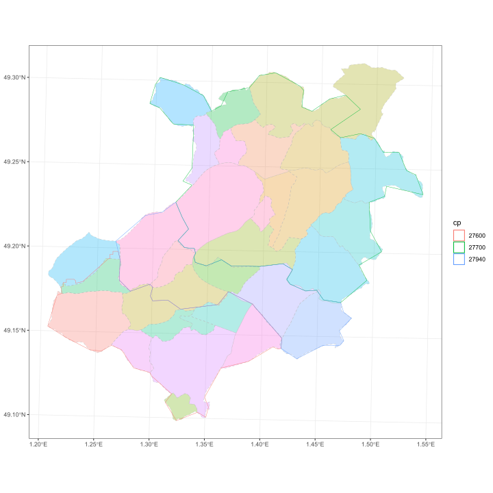
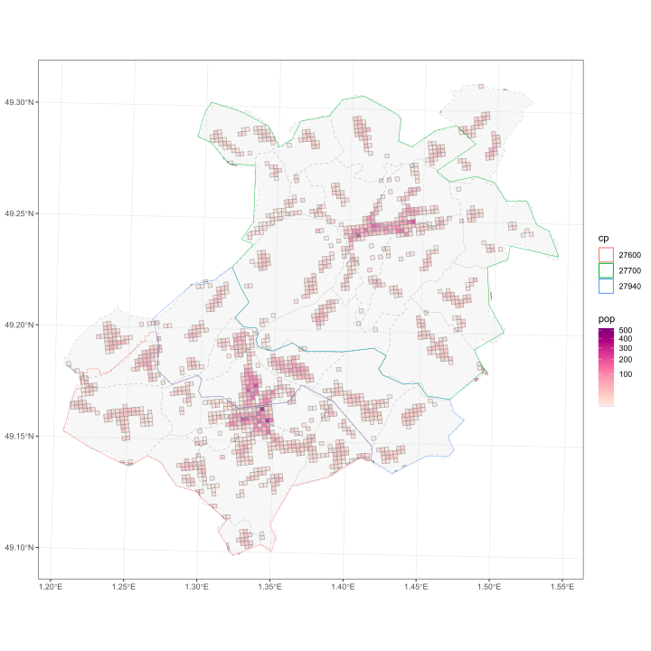

```r

library(dtplyr)
library(tidyverse)
library(magrittr)
library(COMversion)

```

# Présentation générale

## Principe

L'objectif du package `COMversion` est de permettre une navigation
simple entre différents formats de géographie que l'on retrouve
communément dans les données de santé (i.e. codes postaux, codes
communes, codes IRIS) et les différents millésimes des ces formats
(les contours des communes et des IRIS de l'INSEE change en effet au
cours du temps, du fait de regroupements ou de scissions de
communes ; faute d'information disponible, les codes postaux sont
considérés comme fixes au cours du temps). 

Concrètement, on se place dans une situation où l'on souhaite
convertir une unité géographique A définie dans un référentiel
géographique `in` (code postal ou millésime de commune/IRIS) donné,
dans un référentiel `out`. 

Trois cas de figures se présentent alors :

1. A correspond a une unité géographique unique de `out`;
2. A correspond est inclue dans une unité géographique de `out`;
3. A appartient à plusieurs unités géographique de `out`. 

Dans les cas 1. et 2. la conversion de A en géographie `out` est
immédiate. Dans le cas 3., il s'agit de construire une règle
permettant de répartir les observations de A entre les différentes
unité géographiques qui lui correspondent dans `out`.

Pour ce faire, le package se base sur les données de population, pour
calculer le poids de l'unité A dans les unités géographique de
`out`. Par exemple, si A correspond strictement aux unité B et C dans
la géographie `out` (A = union de B et C), les données de A seront
réparties dans B et C au prorata de la taille des populations de B et
C (e.g. 90% des cas de A seront attribuées à B et 10% à C si B est 9
fois plus peuplée que C). 

## Matériel et méthodes

Pour mettre en œuvre ce principe, il faut disposer d'une part de
tables de correspondances entre les géographies permettant de savoir
si la conversion de A dans `out` correspond aux situations
1., 2. ou 3. ; d'autre part de disposer de données de poids permettant
la conversion de A dans le cas 3.

### Tables de correspondances

Les tables de correspondances proviennent de deux sources. 

#### Correspondance millésimes communes/IRIS

Pour le passage d'un millésime de géographie de communes ou d'IRIS,
des tables de correspondances sont mises à dispositions par l'INSEE
(cf. les pages web de l'INSEE pour les
[communes](https://www.insee.fr/fr/information/2028028) et les
[IRIS](https://www.insee.fr/fr/information/2017499)). 

A noter que les passages d'un millésime géographique à un autre
se font toujours avec des correspondances strictes, une commune/IRIS A
dans une géographie d'une année $n$ étant soit absorbée entièrement
dans une commune/IRIS B de la géographie $n+1$, soit scindée
strictement en 2 unités B et C telles que A = union de B et C. A noter
par ailleurs que presque tous les changements d'IRIS sur la période
20016-2021 correspondent à des changements de communes (e.g. commune
non irisée). 

Pour les scissions de communes et d'IRIS confondus avec des scissions
de communes, les tables de populations communales
en géographie de l'année de la scission étaient utilisées pour le
calcul des poids de passage. Pour les
scissions d'IRIS ne relevant pas de ce dernier cas, les tables de
population des IRIS en géographie de l'année de la scission étaient utilisées.

#### Correspondance codes postaux/codes commmunes-IRIS

Pour établir la correspondance entre les codes postaux et les codes
communes, nous nous basons sur un travail réalisé pour l'année 2019 par
[Atlasanté](https://www.data.gouv.fr/fr/datasets/correspondance-code-postal-communes-2019-t-corresp-cp/),
et qui fournit une table de correspondance codes postaux - codes communes. A 
noter que cette table de passage n'existe que pour la géographie 
2019 de l'INSEE, et que la conversion d'un code postal en code
commune/IRIS passera nécessairement pas cette année de référence. 

Contrairement à la situations précédente, les correspondances ne sont
plus strictes, certaines communes-IRIS ayant plusieurs codes postaux,
eux même partagés avec d'autres communes-IRIS. 

La figure suivante illustre le cas pour des IRIS - codes postaux de
l'Eure. Les iris sont représentés par des couleurs de fond et les
contours des codes postaux  par des lignes pleines. Ce cas est
symptomatique de la complexité du découpage en codes postaux par
rapport aux codes communes/IRIS, des codes postaux pouvant découper des
IRIS/communes en deux tout en rattachant des parties d'autres
IRIS/communes. 

<div class="figure">

<p class="caption">Illustration de chevauchement d'IRIS et de codes postaux. Géographie 2019.</p>
</div>

Ces situations de correspondance composite représentent une part marginale, mais non négligeable
des configurations, avec près de 11% des communes et des codes postaux
concernés comme on peut le voir dans le tableau suivant.


```
#> Joining with `by = join_by(com)`
```

<table>
<caption>Décompte des correspondances entres codes postaux et codes communes pour l'année 2019. Source : Atlasanté.</caption>
 <thead>
<tr>
<th style="empty-cells: hide;border-bottom:hidden;" colspan="1"></th>
<th style="border-bottom:hidden;padding-bottom:0; padding-left:3px;padding-right:3px;text-align: center; " colspan="2"><div style="border-bottom: 1px solid #ddd; padding-bottom: 5px; ">Communes</div></th>
<th style="border-bottom:hidden;padding-bottom:0; padding-left:3px;padding-right:3px;text-align: center; " colspan="2"><div style="border-bottom: 1px solid #ddd; padding-bottom: 5px; ">Codes postaux</div></th>
</tr>
  <tr>
   <th style="text-align:left;">  </th>
   <th style="text-align:right;"> n </th>
   <th style="text-align:right;"> % </th>
   <th style="text-align:right;"> n </th>
   <th style="text-align:right;"> % </th>
  </tr>
 </thead>
<tbody>
  <tr>
   <td style="text-align:left;"> cp = com </td>
   <td style="text-align:right;"> 1768 </td>
   <td style="text-align:right;"> 5.0 </td>
   <td style="text-align:right;"> 1768 </td>
   <td style="text-align:right;"> 27.9 </td>
  </tr>
  <tr>
   <td style="text-align:left;"> cp = U com </td>
   <td style="text-align:right;"> 29411 </td>
   <td style="text-align:right;"> 83.9 </td>
   <td style="text-align:right;"> 3734 </td>
   <td style="text-align:right;"> 59.0 </td>
  </tr>
  <tr>
   <td style="text-align:left;"> com = U cp </td>
   <td style="text-align:right;"> 58 </td>
   <td style="text-align:right;"> 0.2 </td>
   <td style="text-align:right;"> 145 </td>
   <td style="text-align:right;"> 2.3 </td>
  </tr>
  <tr>
   <td style="text-align:left;"> Correspondance composite </td>
   <td style="text-align:right;"> 3833 </td>
   <td style="text-align:right;"> 10.9 </td>
   <td style="text-align:right;"> 685 </td>
   <td style="text-align:right;"> 10.8 </td>
  </tr>
  <tr>
   <td style="text-align:left;"> Total </td>
   <td style="text-align:right;"> 35070 </td>
   <td style="text-align:right;"> 100.0 </td>
   <td style="text-align:right;"> 6332 </td>
   <td style="text-align:right;"> 100.0 </td>
  </tr>
</tbody>
</table>

### Données de population

Les tables de populations utilisées pour les cas 3. sont issues des
[recensements](https://www.insee.fr/fr/information/2008354) de
l'INSEE d'une part, et des données de
[carroyage à 200 m](https://www.insee.fr/fr/statistiques/4176290?sommaire=4176305)
2015 de l'INSEE d'autre part. 

Deux types de tables de recensement sont utilisées :

* Les tables de populations communales en géographie 2006 à 2021 ; 
* La table de  population à l'IRIS en géographie 2006 à 2021.


### Passage d'une géographie à une autre

#### Cas 1. et 2.

Ces cas ne posent pas de difficulté particulière. Les tables de
passage suffisent à transformer une géographie en une autre.

#### Cas 3.

##### Correspondance stricte entre les unités géographiques

Lorsque la correspondance entre A dans `in` et B et C dans `out` est
stricte (A = union de B et C), les tables de populations communales
sont utilisées pour calculer les poids de répartition. Cette situation
est la plus courante (tous les passages entre millésimes de
communes/IRIS et majorité des correspondances codes postaux -
communes/IRIS). 

Pour un passage de A vers B et C, on calculera la probabilité
$P(B|A,a,s)$ qu'une observation de A soit dans B pour âge $a$ et un
sexe $s$ donnés, comme :
$$P(B|A,a,s) = \frac{pop_{B,a,s}}{pop_{C,a,s}}$$ avec $pop_{B,a,s}$
la taille de la population d'âge $a$ et de sexe $s$ dans B. A noter
que cette probabilité est calculée l'année de la séparation de A dans
B et C.

A noter que les estimations de population dans les IRIS ne sont
disponibles que par groupes d'âge tous sexes confondus et par sexe
tous âges confondus. Nous avons donc fait l'hypothèse d'une
indépendance entre l'âge et le sexe dans les IRIS
($P(a,s|i)=P(a|i)\times P(s|i)$). Dans certaines situations par
ailleurs (e.g. calcul des probabilités pour des âges précis), nous
seront tenu à faire l'hypothèse que les probabilités par âge sont
constantes dans une tranche d'âge. 

##### Correspondance composite entre les unités géographiques

Dans les situations plus complexes comme celle illustrée précédemment
dans l'Eure, les données du carroyage sont utilisées en conjonction
avec les données de population de l'IRIS.

Dans un premier temps, les données du carroyage sont utilisées pour
calculer la part de la population d'un code postal appartenant à chacun
des IRIS qui le composent. Les données de carroyage donnent, pour un
découpage de 200m par 200m, le nombre d'habitant par carreau. Le
nombre d'habitants d'un code postal A contenu dans un IRIS B qu'il
contient (en partie) peut donc être estimés par la somme des habitants
des carreaux dans l'intersection. 

Cette opération est illustrée dans la figure suivante, où sont
superposés les carreaux du carroyage sur les codes postaux et IRIS de
l'Eure de l'illustration précédente. 

<div class="figure">

<p class="caption">Illustration de chevauchement d'IRIS et de codes postaux, avec données de carroyage 200 m par 200 m. IRIS 2019 ; carreaux 2015.</p>
</div>

Les données de population dans les carreaux permettent de calculer la
probabilité qu'une observation d'un code postal $cp$ donné soit dans un des
IRIS $i$ qu'il recoupe. Si on note par $p_c$ la population du carreau
$c$, cette probabilité est estimée par $$P(i|cp) =
\frac{\sum_{c \in (cp,i)} p_c }{\sum_{c\in (cp)} p_c}$$


Dans un second temps, les données de population à l'IRIS sont
utilisées pour calculer une probabilité qu'un IRIS appartienne à un
code postal par âge et par sexe. Pour un âge $a$ et un sexe $s$
donnés, en faisant l'hypothèse que la répartition de la population par
âge et sexe dans un IRIS est homogène (et donc que
$P(a,s|cp,i)=P(a,s|i)$), l’utilisation de la formule de Bayes donne :

$$ 
P(i|cp,a,s) \propto P(a,s|i,cp)\times P(i|cp) = P(a,s|i)\times P(i|cp)
$$


Grâce à ces probabilités, les observations d'un code postal donné
peuvent être réparties dans les différents IRIS qui le composent. A
noter que les versions de population utilisées pour calculer $P(i|cp)$
(populations 2015) et $P(a,s|i)$ (populations 2017) diffèrent. 

# Utilisation du package `COMversion`

L'ensemble des méthodes exposées précédemment sont implémentées dans
le paquet `COMversion`, qui utilise la fonction principale `pass_geo`
pour :

* Passer d'un millésime de communes/IRIS à un autre;
* Convertir les communes d'un millésime en IRIS du même ou d'un autre millésime;
* Convertir les codes postaux en communes/IRIS d'un millésime donné.

Les arguments de `pass_geo` (`?pass_geo`) sont les suivants :

* `geo_in` et `geo_out` : année de la géographie en entrée et en
  sortie
* `by`: formule permettant de spécifier les states de populations pour
  lesquelles on souhaite calculer les probabilités $P(B|A,a,s)$ et
  $P(i|cp,a,s)$. Un `by=~1` utilisera des probabilités tous ages et
  sexes confondus, `by=~sexe` des probabilités par sexe et
  `by=~sexe+cut(age,breaks=c(-Inf,50,Inf))` des probabilités par sexe
  et groupes d'âge des 50 ans et moins et des plus de 50 ans
* `geo` : donne la géographie de départ et de sortie souhaitées avec
  une formule. Par exemple, `com~com` (équivalent à `~com`) donnera une
  correspondance commune-commune, `cp~com`une correspondance code
  postale-commune...
* `data` : possibilité de donner une table d'observation en entrée,
  sur laquelle les conversions de géographie sont appliquées. La table
  en sortie sera une table avec la géographie de sortie, dans laquelle
  les variables numériques sont réparties dans les nouvelles
  géographies. Il est possible de conserver des variables de la table
  d'entrée telles que en sortie (les rajouter au `by`) à condition
  qu'elles ne varient pas selon les géographies impactées par les
  conversions. Par ailleurs, les regroupements de classes d'âges
  opérés dans le `by` (par exemple by=~cut(age,breaks=c(-Inf,50,Inf)))
  sont appliquées à la table d'entrée par défaut. Mettre `data_by =
  FALSE` sinon.

Si ce dernier argument `data` est laissé à `NULL`, une table de
correspondance avec les probabilités de passage entre les géographies
est retournée.

L'ensemble des données nécessaires aux opérations de passage sont
stockées dans des bases internes (`?COMdata`).


## Exemples d'utilisation

### Passage d'un millésime de commune à un autre

On souhaite passer d'une version des communes en géographie 2015 en une
géographie 2017.


```r

com_15_17<-pass_geo(geo_in = 2015,
                    geo_out = 2017,
                    geo=~com,
                    by=~1
                    )
#> ---------------------------------------
#> Fusions et scissions entre les périodes
#> ---------------------------------------
#> 
#> |statut    |  Freq|
#> |:---------|-----:|
#> |Fusion    |  1750|
#> |Inchangée | 34949|
#> |Scission  |     1|
#> --------------------------------------------------------------------------------
#> Les poids des communes séparées sont calculés au prorata de leurs populations
#> au moment de la scission
#> --------------------------------------------------------------------------------

com_15_17%>%
  group_by(statut)%>%
  slice(1:5)
#> # A tibble: 12 × 5
#> # Groups:   statut [3]
#>    com   com_out pds_com statut    annee_geo
#>    <fct> <fct>     <dbl> <fct>         <dbl>
#>  1 01015 01015     1     Fusion         2017
#>  2 01340 01015     1     Fusion         2017
#>  3 01080 01080     1     Fusion         2017
#>  4 01119 01080     1     Fusion         2017
#>  5 01095 01095     1     Fusion         2017
#>  6 13201 13201     1     Inchangée      2017
#>  7 13202 13202     1     Inchangée      2017
#>  8 13203 13203     1     Inchangée      2017
#>  9 13204 13204     1     Inchangée      2017
#> 10 13205 13205     1     Inchangée      2017
#> 11 76676 76601     0.110 Scission       2017
#> 12 76676 76676     0.890 Scission       2017
```
La colonne `com` donne la commune de départ (géographie 2015) et
`com_out` la commune d'arrivée  (géographie 2017). Les poids (colonne
`pds_com`) sont calculés ici tous ages et sexes confondus. Comme
attendu, ils sont différent de 1 seulement pour les communes s'étant
séparées. 

L'utilisation d'un poids unique pour la scissions de la commune A en B
et C peu sembler assez restrictif, les communes A et B pouvant avoir des
différences dans les structures de populations. `pass_geo` dispose
aussi d'un argument `by` qui permet de calculer des poids par
structure de population. Si on veut calculer des poids par sexe par
exemple :


```r

pass_geo(geo_in = 2015,
         geo_out = 2017,
         by=~sexe
         )%>%
  filter(statut=="Scission")
#> ---------------------------------------
#> Fusions et scissions entre les périodes
#> ---------------------------------------
#> 
#> |statut    |  Freq|
#> |:---------|-----:|
#> |Fusion    |  1750|
#> |Inchangée | 34949|
#> |Scission  |     1|
#> --------------------------------------------------------------------------------
#> Les poids des communes séparées sont calculés au prorata de leurs populations
#> au moment de la scission
#> --------------------------------------------------------------------------------
#> # A tibble: 4 × 6
#>   com   com_out  sexe pds_com statut   annee_geo
#>   <fct> <fct>   <dbl>   <dbl> <fct>        <dbl>
#> 1 76676 76601       1   0.112 Scission      2017
#> 2 76676 76676       1   0.888 Scission      2017
#> 3 76676 76601       2   0.108 Scission      2017
#> 4 76676 76676       2   0.892 Scission      2017
```

Ou par sexe et par âge pour les plus ou moins de 90 ans.


```r

pass_geo(geo_in = 2015,
         geo_out = 2017,
         by=~cut(age,breaks=c(-Inf,90,Inf))+sexe
         )%>%
  filter(statut=="Scission")
#> ---------------------------------------
#> Fusions et scissions entre les périodes
#> ---------------------------------------
#> 
#> |statut    |  Freq|
#> |:---------|-----:|
#> |Fusion    |  1750|
#> |Inchangée | 34949|
#> |Scission  |     1|
#> --------------------------------------------------------------------------------
#> Les poids des communes séparées sont calculés au prorata de leurs populations
#> au moment de la scission
#> --------------------------------------------------------------------------------
#> # A tibble: 8 × 7
#>   com   com_out age        sexe pds_com statut   annee_geo
#>   <fct> <fct>   <fct>     <dbl>   <dbl> <fct>        <dbl>
#> 1 76676 76601   (-Inf,90]     1   0.112 Scission      2017
#> 2 76676 76676   (-Inf,90]     1   0.888 Scission      2017
#> 3 76676 76601   (-Inf,90]     2   0.108 Scission      2017
#> 4 76676 76676   (-Inf,90]     2   0.892 Scission      2017
#> 5 76676 76601   (90, Inf]     1   1     Scission      2017
#> 6 76676 76676   (90, Inf]     1   1     Scission      2017
#> 7 76676 76601   (90, Inf]     2   0     Scission      2017
#> 8 76676 76676   (90, Inf]     2   1     Scission      2017
```

Les différences sont assez faibles (comme attendu pour des communes
proches), mais peut permettre d'éviter parfois d'avoir des problèmes
d'inadéquation du numérateur ou du dénominateur (ou en
créer)... Possible en tous cas.

Un fois les poids disponibles, on peut les appliquer à une table dans
une géographie données pour passer d'une version à une autre.
Par exemple, pour passer la table `dt_pop_2013`, en géographie 2015,
en géographie 2017 :


```r

data(dt_pop_2013)

dt_pop_2013%>%
  left_join(com_15_17,by="com")%>%
  group_by(com_out)%>%
  summarise(pop=sum(pds_com*pop))
#> Warning in left_join(., com_15_17, by = "com"): Each row in `x` is expected to match at most 1 row in `y`.
#> ℹ Row 6292201 of `x` matches multiple rows.
#> ℹ If multiple matches are expected, set `multiple = "all"` to silence this warning.
#> # A tibble: 35,441 × 2
#>    com_out    pop
#>    <fct>    <dbl>
#>  1 01001     767.
#>  2 01002     236.
#>  3 01004   14359.
#>  4 01005    1635.
#>  5 01006     108.
#>  6 01007    2503.
#>  7 01008     744 
#>  8 01009     337 
#>  9 01010    1108.
#> 10 01011     394.
#> # … with 35,431 more rows
```

La même opération peut cependant  se faire directement avec la fonction
`pass_geo`, grâce à l'argument data. 


```r

pass_geo(data=dt_pop_2013,
         geo_in = 2015,
         geo_out = 2017)
#> ---------------------------------------
#> Fusions et scissions entre les périodes
#> ---------------------------------------
#> 
#> |statut    |  Freq|
#> |:---------|-----:|
#> |Fusion    |  1750|
#> |Inchangée | 34949|
#> |Scission  |     1|
#> --------------------------------------------------------------------------------
#> Les poids des communes séparées sont calculés au prorata de leurs populations
#> au moment de la scission
#> --------------------------------------------------------------------------------
#> # A tibble: 35,441 × 5
#>    com   annee_pop    pop statut    annee_geo
#>    <chr>     <dbl>  <dbl> <chr>         <dbl>
#>  1 01001    402600   767. Inchangée      2017
#>  2 01002    402600   236. Inchangée      2017
#>  3 01004    402600 14359. Inchangée      2017
#>  4 01005    402600  1635. Inchangée      2017
#>  5 01006    402600   108. Inchangée      2017
#>  6 01007    402600  2503. Inchangée      2017
#>  7 01008    402600   744  Inchangée      2017
#>  8 01009    402600   337  Inchangée      2017
#>  9 01010    402600  1108. Inchangée      2017
#> 10 01011    402600   394. Inchangée      2017
#> # … with 35,431 more rows
```

Avec cette utilisation de la
fonction, toutes les variables numériques sont agrégées (ce qui n'a
pas tellement de sens pour certaines variables comme l'année de
population par exemple). 
On peut rajouter des variables dans l'argument `by` afin qu'elle se
soient pas modifiées. On ajoute donc l'année de population et
également le département à conserver. 
On modifie également le `by`
pour avoir une pondération par age et sexe, et on veut passer
finalement en une géographie 2013:


```r

pass_geo(data=dt_pop_2013,
         geo_in = 2015,
         geo_out = 2013,
         by=~sexe+cut(age,breaks=c(-Inf,65,Inf))+dep+annee_pop)
#> ---------------------------------------
#> Fusions et scissions entre les périodes
#> ---------------------------------------
#> 
#> |statut    |  Freq|
#> |:---------|-----:|
#> |Fusion    |     4|
#> |Inchangée | 36682|
#> |Scission  |    14|
#> --------------------------------------------------------------------------------
#> Les poids des communes séparées sont calculés au prorata de leurs populations
#> au moment de la scission
#> --------------------------------------------------------------------------------
#> # A tibble: 146,824 × 8
#>    com    sexe age       dep   annee_pop    pop statut    annee_geo
#>    <chr> <dbl> <fct>     <chr>     <int>  <dbl> <chr>         <dbl>
#>  1 01001     1 (-Inf,65] 01         2013  334.  Inchangée      2013
#>  2 01001     1 (65, Inf] 01         2013   55.1 Inchangée      2013
#>  3 01001     2 (-Inf,65] 01         2013  315.  Inchangée      2013
#>  4 01001     2 (65, Inf] 01         2013   62.9 Inchangée      2013
#>  5 01002     1 (-Inf,65] 01         2013  103.  Inchangée      2013
#>  6 01002     1 (65, Inf] 01         2013   22.2 Inchangée      2013
#>  7 01002     2 (-Inf,65] 01         2013   93.8 Inchangée      2013
#>  8 01002     2 (65, Inf] 01         2013   17.1 Inchangée      2013
#>  9 01004     1 (-Inf,65] 01         2013 6006.  Inchangée      2013
#> 10 01004     1 (65, Inf] 01         2013  870.  Inchangée      2013
#> # … with 146,814 more rows
```


# Passage d'une version d'IRIS à un autre

La fonction `pass_geo` permet aussi de passer d'une version d'IRIS à
une autre.

On utilise pour cela l'argument `geo ` de la fonction :


```r

iris_16_18<-pass_geo(geo_in = 2016,
                     geo_out = 2020,
                     geo=iris~iris
                     )
#> ---------------------------------------
#> Fusions et scissions entre les périodes
#> ---------------------------------------
#> 
#> |statut    |  Freq|
#> |:---------|-----:|
#> |Fusion    |  1385|
#> |Inchangée | 34541|
#> |Scission  |     1|
#> --------------------------------------------------------------------------------
#> Les poids des communes séparées sont calculés au prorata de leurs populations
#> au moment de la scission
#> --------------------------------------------------------------------------------
#> En supplément des modifications de commues,  2  iris ont fusionnés ou été séparés:
#>  ->  2  scissions
iris_16_18%>%
  group_by(statut)%>%
  slice(1:5)
#> # A tibble: 14 × 5
#> # Groups:   statut [4]
#>    iris      iris_out  pds_iris statut            annee_geo
#>    <chr>     <chr>        <dbl> <chr>                 <dbl>
#>  1 010250000 010250000    1     Fusion                 2020
#>  2 010330101 010330103    1     Fusion                 2020
#>  3 010330102 010330102    1     Fusion                 2020
#>  4 010330201 010330201    1     Fusion                 2020
#>  5 010330202 010330202    1     Fusion                 2020
#>  6 010010000 010010000    1     Inchangée              2020
#>  7 010020000 010020000    1     Inchangée              2020
#>  8 010040101 010040101    1     Inchangée              2020
#>  9 010040102 010040102    1     Inchangée              2020
#> 10 010040201 010040201    1     Inchangée              2020
#> 11 766760000 766760000    0.756 Scission               2020
#> 12 766760000 766010000    0.244 Scission               2020
#> 13 147120000 146660000    0.5   com In./iris Sci.      2020
#> 14 146660000 147120000    0.5   com In./iris Sci.      2020
```

On voit dans cet exemple que 47 IRIS ont connus des fusions en
addition des 


# Passage d'une version de codes postaux à des codes IRIS/codes commune

`pass_geo` peut être utilisée aussi pour convertir des codes postaux
en iris ou en commune. A noter que l'argument `geo_in` ici est
inutile, la conversion se faisant dans tous les cas sur une base de
correspondance en géographie 2019. On peut en revanche choisir un
millésime de sortie, 2016 par exemple :


```r

cp_iris<-pass_geo(geo_in = 2016,
                  geo_out = 2016,
                  by=~1,
                  geo=cp~iris
                  )
#> Geography for postal code only available for 2019
#> ---------------------------------------
#> Fusions et scissions entre les périodes
#> ---------------------------------------
#> 
#> |statut    |  Freq|
#> |:---------|-----:|
#> |Fusion    |     2|
#> |Inchangée | 34545|
#> |Scission  |   465|
#> --------------------------------------------------------------------------------
#> Les poids des communes séparées sont calculés au prorata de leurs populations
#> au moment de la scission
#> --------------------------------------------------------------------------------
cp_iris
#> # A tibble: 51,934 × 5
#>    cp    iris      pds_iris statut    annee_geo
#>    <fct> <chr>        <dbl> <chr>         <dbl>
#>  1 01000 010530101  0.00567 Inchangée      2016
#>  2 01000 010530102  0.0549  Inchangée      2016
#>  3 01000 010530103  0.00558 Inchangée      2016
#>  4 01000 010530201  0.00656 Inchangée      2016
#>  5 01000 010530202  0.0621  Inchangée      2016
#>  6 01000 010530203  0.0571  Inchangée      2016
#>  7 01000 010530301  0.0763  Inchangée      2016
#>  8 01000 010530302  0.0943  Inchangée      2016
#>  9 01000 010530401  0.0631  Inchangée      2016
#> 10 01000 010530402  0.0698  Inchangée      2016
#> # … with 51,924 more rows
```

On peut vérifier que les poids de répartition des codes postaux
somment bien à 1:


```r

cp_iris%>%
  group_by(cp)%>%
  summarise(p=sum(pds_iris))%$%range(p)
#> [1] 1 1
```


Idem si on préfère les résultats par commune et par sexe :


```r

cp_com<-pass_geo(geo_in = 2019,
                 geo_out = 2016,
                 by=~sexe,
                 geo=cp~com
                 )
#> ---------------------------------------
#> Fusions et scissions entre les périodes
#> ---------------------------------------
#> 
#> |statut    |  Freq|
#> |:---------|-----:|
#> |Fusion    |     2|
#> |Inchangée | 34545|
#> |Scission  |   465|
#> --------------------------------------------------------------------------------
#> Les poids des communes séparées sont calculés au prorata de leurs populations
#> au moment de la scission
#> --------------------------------------------------------------------------------
cp_com%>%
  group_by(cp)%>%
  summarise(p=sum(pds_com))%$%range(p)
#> [1] 2 2
```

